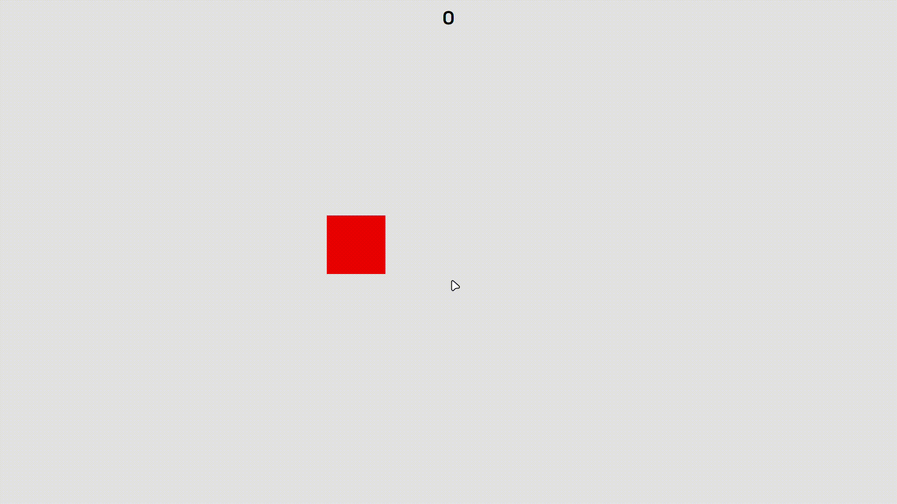

# square-clicker

🟥 A simple square click game made in JS

## How it works
You just need simple to click on the squares that appear on the screen.  
Each time you click, the browser will create another square, and you need to click on all of them.

## How to play
Go to [square clicker](flameastro.github.io/square-clicker/) website and play it!
